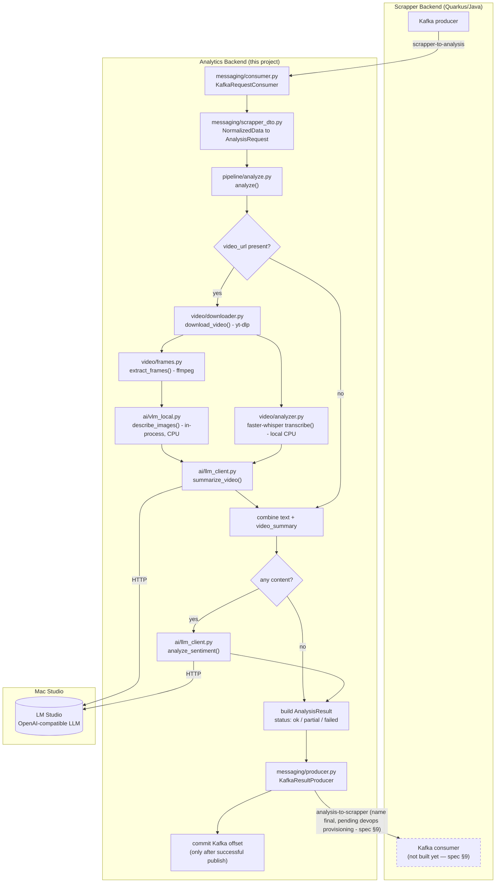

# Analytics Backend — Design Spec

Date: 2026-09-14
Status: Approved by user (Kacang), ready for implementation planning

## 1. Purpose

`analyzer_sentiment` implements the **Analytics Backend** in the broader
scraping/sentiment system (see `docs/references/system-flow.mmd` and
`docs/to-do.md`). It is a standalone Python service, independent from the
Scrapper Backend (built by another developer) and the Sentiment Backend.

Per item, it must:

1. Receive a normalized item (plain text and/or a video URL) from the
   Scrapper Backend via Kafka.
2. If a video URL is present, download the video (max ~10 minutes long)
   and run it through a video analyzer (adapted from
   `docs/references/server.py`'s approach, handed off by the supervisor —
   see §4) to get both a VLM-generated summary and a raw speech
   transcript.
3. Combine that video output with our own LLM into a final
   `video_summary` text.
4. Combine available text and `video_summary` into one context.
5. Run sentiment/emotion/motivation analysis on that context using an
   LLM (and the VLM if visual cues are analyzed directly as part of this
   step).
6. Publish the result back to the Scrapper Backend via Kafka, one item
   at a time — mirroring how items arrive.

`docs/references/Analyst_Batches.json` (an n8n workflow) is **reference
only** — useful for understanding a prior text-only sentiment prompt/schema
attempt, not part of the target architecture.

## 2. Scope / Non-goals

**In scope (v1):**
- Kafka consumer/producer for the Analytics Backend's own request/response
  topics.
- Video download (TikTok, Instagram, Facebook, Twitter/X — max ~10
  minutes per video, confirmed by the user).
- A video analyzer that adapts `docs/references/server.py`'s *approach*
  (sample frames, get a whole-clip VLM description, optionally
  transcribe audio) using components that all run **in-process, CPU-only,
  on this service's own Windows machine** (see §3, §4): local `ffmpeg`
  frame extraction, a local (not HTTP-served) lightweight VLM via
  `transformers`, and local CPU speech transcription via `faster-whisper`.
- Turning that video analyzer's output (VLM summary + raw transcript)
  into a final `video_summary` via our own LLM.
- Sentiment/emotion/motivation analysis via an LLM (and VLM where
  relevant), called over an OpenAI-compatible HTTP API (model-agnostic —
  see §4).
- Graceful handling of items missing text or missing video.

**Out of scope (v1):**
- Building or training a video understanding/summarization model from
  scratch — we use an existing lightweight, openly-published VLM
  (`llava-hf/llava-onevision-qwen2-0.5b-ov-hf`, see §4/§9), not a custom
  one. We only adapt `server.py`'s frame-sampling-then-describe approach
  into components that run where this service actually runs.
- Kafka topic names/message contract finalization with the Scrapper
  Backend developer (not yet coordinated — see §9 Open Assumptions).
- Dead-letter topics / advanced retry orchestration beyond bounded
  in-process retries.
- End-to-end integration tests against a real Kafka cluster or real
  model weights (VLM/whisper).

## 3. Architecture

Single Python service, single Kafka consumer group, **synchronous
per-message processing**: each message is fully processed (video
download → video analysis → video summarization → text+video sentiment
analysis → publish result) before the next message is picked up, and the
offset is committed only after a successful publish.

This was chosen over two alternatives:
- **Async worker pool in-process** — rejected for v1: added concurrency
  complexity, but the real bottleneck is shared model inference (VLM,
  whisper, and the remote LLM endpoint), not the orchestration code, so
  in-process concurrency wouldn't reliably raise throughput.
- **Separate gateway + task-queue workers (e.g. Celery/RQ + Redis)** —
  rejected for v1: introduces a second broker alongside Kafka with no
  demonstrated need yet.

If throughput becomes a bottleneck later, scale via standard Kafka
mechanisms: more partitions + more consumer replicas. Each replica now
loads **both** the local `faster-whisper` model **and** the local VLM at
startup (real CPU/RAM cost — see the revision history note below) and
makes outbound HTTP calls only for the LLM — the service itself is
otherwise stateless, so replica scaling is straightforward, but replica
count should be sized against available RAM/CPU, not assumed free like
before the VLM moved back in-process.

**Revision history note:** this service's video-analysis approach has
changed three times during design:
1. Originally going to host/choose its own open-source video
   summarization model.
2. Then going to run the supervisor's `mlx-vlm`/`mlx-whisper` code
   in-process, assuming this service would run on the same Mac Studio as
   the models. It was clarified that this service actually runs on a
   **local Windows machine**, separate from the Mac Studio — and
   `mlx-vlm`/`mlx-whisper` depend on MLX, which is Apple-Silicon-only
   with no Windows build (Docker cannot change this — a container still
   runs on the host's real CPU architecture). This led to calling the VLM
   remotely over HTTP instead (whatever devops ended up hosting on the
   Mac Studio), while `faster-whisper` (a portable, CPU-friendly
   reimplementation with no MLX/Apple dependency) ran locally.
3. The supervisor then asked that the VLM **not** be served over HTTP at
   all — mirroring how `faster-whisper` already runs locally, the VLM
   should be called directly, in-process, on this same CPU-only Windows
   machine. Since `mlx-vlm` still can't run there, this is a **different
   library** (`transformers`, with a small multi-image-capable model,
   `llava-hf/llava-onevision-qwen2-0.5b-ov-hf`), not a reversion to
   `mlx-vlm`. See §4/§9 for the resulting design and the new dependencies
   this adds (`torch`, `transformers`, `pillow`).

## 4. Components

```
src/
  main.py              # entrypoint: load the local whisper + VLM models once, then start Kafka consumer loop
  config.py            # env-based settings (Kafka, LLM base url+model, VLM model id, whisper model size, frame/timeout/retry settings)
  schemas.py           # pydantic models: AnalysisRequest, AnalysisResult, internal DTOs
  messaging/
    scrapper_dto.py     # wire-format model matching the Scrapper Backend's real Kafka message (NormalizedData) + translation into AnalysisRequest
    consumer.py        # Kafka consume wrapper: subscribes to the single scrapper topic, translates via scrapper_dto.py
    producer.py         # Kafka publish wrapper
  pipeline/
    analyze.py          # use-case orchestrator: optional text/video -> summary -> sentiment result
  video/
    downloader.py       # yt-dlp wrapper (TikTok/IG/FB/X)
    frames.py            # ffmpeg wrapper: extract N evenly-spaced frames from a video file as raw JPEG bytes
    analyzer.py          # adapted from docs/references/server.py's approach: frame extraction + in-process VLM call (via ai/vlm_local.py) for the summary, local faster-whisper for the transcript
  ai/
    vlm_local.py         # loads a lightweight VLM once (transformers, CPU) and runs multi-image inference in-process — no HTTP, no remote endpoint
    llm_client.py         # thin HTTP client, OpenAI-compatible endpoint (LM Studio), video summarization + sentiment/emotion/motivation
```

Business logic (`pipeline/`, `video/`, `ai/`) is kept independent of the
Kafka transport (`messaging/`) — `main.py` wires them together. Each
module has one clear responsibility, consistent with Acme's structure
standards (business logic out of handlers, one responsibility per file).

### `video/analyzer.py` and `video/frames.py` (adapted from `docs/references/server.py`)

`docs/references/server.py` is a FastAPI server, meant for macOS/Apple
Silicon, that loads `mlx-vlm` and `mlx-whisper` once at startup and, per
request, runs a **single whole-video mlx-vlm call** (multi-frame,
temporally-aware — not a frame-by-frame loop) to produce `summary`, plus
optional `mlx-whisper` transcription to produce `transcript` +
`transcript_segments`. Since this service runs on a Windows machine, we
adapt the *approach*, not the code, using pieces that actually run
there:

- `video/frames.py` extracts a fixed number of evenly-spaced frames from
  the downloaded video via `ffmpeg` (a system binary, cross-platform —
  must be present on PATH; see §9), returning them as raw JPEG bytes
  (fed directly to `ai/vlm_local.py`, no HTTP transport, so no base64
  encoding is needed). This replaces `mlx-vlm`'s internal frame sampling.
- `video/analyzer.py`'s summary step decodes those frames to images and
  sends them plus a prompt to `ai/vlm_local.py`'s `describe_images()` —
  one in-process, CPU-only multi-image chat completion via `transformers`
  (`llava-hf/llava-onevision-qwen2-0.5b-ov-hf` by default, see §9),
  loaded once at `main.py` startup. This replaces `mlx_vlm.generate()`
  with a different, Windows/CPU-portable library rather than a return to
  `mlx-vlm`.
- `video/analyzer.py`'s transcript step runs `faster-whisper` **locally,
  on this Windows machine's CPU** (no GPU available here — see §9). This
  replaces `mlx_whisper.transcribe()`. Both the whisper model and the VLM
  are loaded once at `main.py` startup, mirroring `server.py`'s
  `lifespan` pattern.
- The public shape of this module — `VideoAnalysisError`,
  `VideoAnalysis`, `AnalyzerModels`, `analyze_video()` — is unchanged:
  `analyze_video()` still takes a video file path and returns a summary +
  optional transcript, so `pipeline/analyze.py` (§5) does not need to
  know or care that both the summary and the transcript now come from
  local CPU models rather than one being a network call.
- We call it with `include_transcript=True` always (see §5) — the raw
  transcript is needed downstream for exact wording, not just the VLM's
  descriptive summary.

### Model access (LLM, and VLM)

The LLM used for video summarization (step 3) and sentiment/emotion/
motivation analysis (step 5) is accessed as an **OpenAI-compatible HTTP
API** — already decided: **LM Studio**, running on the Mac Studio. This
is unaffected by the VLM change below — the LLM remains remote.

The VLM (used by `video/analyzer.py` for the whole-video summary) runs
**in-process on this same CPU-only Windows machine** — no HTTP, no Mac
Studio dependency, no devops-hosted endpoint to coordinate. This was a
deliberate reversal of the earlier remote-HTTP-VLM design (see §3
revision history): the supervisor asked that the VLM be called directly
rather than served over HTTP, the same way `faster-whisper` already
runs. `ai/vlm_local.py` loads the model/processor once via `transformers`
and exposes a `describe_images()` call with the same one-call,
all-frames-at-once shape the previous HTTP client had, so
`video/analyzer.py`'s `generate_summary` closure barely changed. Default
model: `llava-hf/llava-onevision-qwen2-0.5b-ov-hf` (0.5B params — chosen
for CPU-only feasibility; see §9 for the sizing rationale and the
new `torch`/`transformers`/`pillow` dependencies this adds).

## 5. Data Flow

### Flow diagram

Dashed boxes are still open items (see §9): the Scrapper Backend has no
Kafka consumer yet for results. Everything else reflects the current,
implemented flow — including the VLM, which now runs in-process (no
network hop, no Mac Studio box for it).



This diagram omits the graceful-degrade branches (video download/analyzer
failure, sentiment failure) for readability — see §6 Error Handling for
those.

### Steps

**Revised twice now: the Scrapper Backend's real Kafka contract was confirmed
by reading its source directly** (see `messaging/scrapper_dto.py`). It
originally published to two separate topics with two separate DTOs
(`post-scrapper-to-analysis`/`NormalizedPostDto` and
`comment-scrapper-to-analysis`/`NormalizedCommentDto`); the Scrapper Backend
then merged these into a single topic and a single unified DTO, described
below (the two-topic version is no longer current — see §9 for the exact
commit that changed this).

1. Consumer subscribes to the **single** topic the Scrapper Backend
   publishes to (Quarkus/SmallRye, confirmed from its `application.yml`):
   `scrapper-to-analysis` (`NormalizedDataDto`), which now carries an
   explicit `platform` field (populated into `AnalysisRequest.platform`,
   normalizing case — the Scrapper Backend's own `Platform` enum
   inconsistently serializes Facebook as `"Facebook"` while every other
   platform is lowercase) and a `type` field (`"POST"` / `"COMMENT"` /
   `"REPLY"`, carried through in `metadata`, not used for branching).
   `messaging/scrapper_dto.py` translates it into our internal
   `AnalysisRequest { id, text: str | None, video_url: str | None,
   platform: Platform | None, metadata: dict }`: `message` becomes
   `text`, `videoUrl` becomes `video_url` (passed through as-is
   regardless of `type` — no assumption is made that only posts carry
   video). Other DTO fields (`url`, `imageUrl`, `authorUsername`,
   `authorName`, `views`, `likes`, `repliesCount`, `uploadedAt`,
   `commentTo`) are carried through in `metadata` for traceability;
   `imageUrl` is not otherwise processed (no image-only analysis path
   exists — out of scope unless requested). Malformed messages
   (parse/validation failure) are logged and skipped (committed, not
   retried).
2. `pipeline.analyze(request)`:
   - If `video_url` is present:
     1. Download it (`video/downloader.py`).
     2. Run it through `video/analyzer.py`:
        a. `video/frames.py` extracts evenly-spaced frames via `ffmpeg`.
        b. The frames + a prompt go to `ai/vlm_local.py` (in-process,
           CPU-only inference — no network call) to produce `summary`.
        c. If `include_transcript=True` (always, per §4): the local
           `faster-whisper` model transcribes the audio to produce
           `transcript` and `transcript_segments`.
     3. Send `summary` + `transcript` to `ai/llm_client.py` to produce
        the final `video_summary: str` (our LLM synthesizes/refines the
        VLM description and the verbatim transcript into one coherent
        summary for downstream sentiment analysis).
   - If `video_url` is absent: `video_summary = None`.
   - Combine `text` (if present) and `video_summary` (if present) into
     one analysis context.
   - If both are absent/empty: skip analysis, result is marked as failed
     with reason "insufficient input" (no text or video content).
   - Otherwise, call `ai/llm_client.py` with a structured prompt (adapted
     from the n8n reference prompt) to produce sentiment, emotion, and
     motivation analysis.
3. Results are assembled into an `AnalysisResult`, correlated to the
   original item via `id`, and published to the response topic.
4. The consumer commits the offset only after a successful publish
   (at-least-once delivery).

### Message schemas

**Incoming (confirmed against the Scrapper Backend's real source — see §9 for
what's still open):**

`scrapper-to-analysis` topic (`NormalizedDataDto`) — merged from the
earlier separate post/comment topics/DTOs:
```json
{
  "id": "string",
  "platform": "twitter | tiktok | instagram | Facebook | ...",
  "type": "POST | COMMENT | REPLY",
  "message": "string | null",
  "url": "string | null",
  "videoUrl": "string | null",
  "imageUrl": "string | null",
  "authorUsername": "string | null",
  "authorName": "string | null",
  "views": 0,
  "likes": 0,
  "repliesCount": 0,
  "uploadedAt": 0,
  "commentTo": "string | null"
}
```

`platform` (note the real, observed inconsistent casing for Facebook above)
maps to `AnalysisRequest.platform`; unrecognized/absent values degrade to
`None` rather than rejecting the message. `type`/`commentTo` and the other
fields not otherwise consumed are carried through in `AnalysisRequest.metadata`
(see §5 Steps).

Outgoing result — schema unaffected by the above (this is our own
`AnalysisResult` shape, published to a topic name that is **still a
placeholder**, since the Scrapper Backend has no Kafka consumer for it yet —
see §9):
```json
{
  "id": "string",
  "status": "ok | partial | failed",
  "video_summary": "string | null",
  "context": {
    "topic": "string",
    "key_themes": ["string"]
  },
  "sentiment": {
    "label": "positive | negative | neutral",
    "score": 0.0,
    "indicators": ["string"]
  },
  "emotion": {
    "primary": "string",
    "secondary": "string",
    "intensity": 0.0,
    "indicators": ["string"]
  },
  "motivation": {
    "type": "string",
    "confidence_score": 0.0,
    "indicators": ["string"]
  },
  "error": "string | null"
}
```

`status: "partial"` covers graceful-degrade cases (e.g. video failed to
download but text analysis still succeeded). `status: "failed"` covers
insufficient input or exhausted retries; `error` carries the reason.

## 6. Error Handling

- **Video download failure** (private, deleted, unsupported format):
  graceful degrade — continue with text-only analysis if text is
  available, set `video_summary: null`, note the reason in `error`, mark
  `status: "partial"`. Does not fail the whole item.
- **Video analyzer failure** (`video/analyzer.py` / `video/frames.py` —
  `ffmpeg` errors, e.g. corrupt file or unsupported codec; local
  `faster-whisper` errors; or the in-process VLM call raising, e.g. an
  out-of-memory error — see below): same graceful degrade as a download
  failure — fall back to text-only with `status: "partial"` if text is
  available, or `status: "failed"` if it isn't.
- **VLM inference failures** (`ai/vlm_local.py`, in-process, no network
  involved): no HTTP retry/backoff applies here (there is no transient
  network error to retry — a crash means the model/inputs themselves are
  the problem), so any exception is wrapped once as `VLMLocalError` and
  surfaces immediately as a video analyzer failure (previous bullet).
- **Transient errors calling the LLM HTTP endpoint** (timeout, 5xx):
  bounded retry with backoff (default 3 attempts, configurable) via
  `ai/llm_client.py`'s own retry logic. If retries are exhausted, the
  failure surfaces as a video analyzer failure (video summarization call)
  or, for the sentiment-analysis LLM call, a `status: "failed"` result
  with the error reason (so the Scrapper Backend is not left waiting
  indefinitely) — offset is committed either way, avoiding a poison-pill
  message blocking the consumer forever.
- No dead-letter topic in v1; failed items are visible via the
  `status`/`error` fields in the result and via service logs.
- **Process shutdown (Ctrl-C / `SIGINT`)**: `main.py`'s consume loop is
  wrapped so a `KeyboardInterrupt` stops it cleanly (logs a shutdown
  message, closes the Kafka consumer) instead of dumping a raw traceback.
  This is deliberately separate from the per-message `except Exception`
  handling above — a `KeyboardInterrupt` is not an `Exception` subclass in
  Python, so it is never mistaken for a processing failure and never
  triggers a retry/continue.

## 7. Testing Strategy

- Unit tests for `pipeline.analyze()` with mocked LLM/VLM clients,
  downloader, and video analyzer, covering: text+video, video-only,
  text-only, both-missing, video-download-failure (degrade path),
  video-analyzer-failure (degrade path), LLM-retry-exhausted (failed
  path).
- Unit tests for `schemas.py`: malformed input rejected, optional fields
  behave as optional.
- Unit tests for `ai/llm_client.py`: request construction, response
  parsing, retry/backoff behavior — HTTP calls mocked, no real endpoint
  hit in tests.
- Unit tests for `ai/vlm_local.py`: `describe_images()` is exercised
  against a fake model/processor pair (`MagicMock`, real `torch` tensors
  for the shape-sensitive slicing logic) — verifies the chat-template/
  image-placeholder construction, that `max_tokens` reaches `generate()`,
  and that failures are wrapped as `VLMLocalError`. `load_local_vlm()`
  itself (the real `from_pretrained()` calls) is not exercised in tests
  (real model weights, slow to download/load — same reasoning as
  `faster-whisper` below).
- Unit tests for `video/downloader.py`: invalid/private/unsupported URL
  handling — yt-dlp calls mocked, no real downloads in tests.
- Unit tests for `video/frames.py`: `ffmpeg` invocation mocked, no real
  frame extraction in tests.
- Unit tests for `video/analyzer.py`: `video/frames.py`, `ai/vlm_local.py`,
  and the local whisper model are all injected as fakes/mocks — verify
  our wrapper passes the right arguments, combines their outputs
  correctly, and handles their failure modes (halt on VLM failure,
  degrade on transcription-only failure). Loading the real local whisper
  model and VLM at startup is not exercised in these tests (real model
  weights, slow); everything downstream of that load is.
- All functions carry type hints; data models use pydantic. `pytest` +
  a linter/type-checker (e.g. `ruff` + `mypy`) must pass before any task
  is considered done, per Acme's testing standard.
- No end-to-end Kafka integration test in v1; boundaries are covered by
  mocked unit tests instead.

## 8. Deployment

**Revised again in this update:** Docker is still viable, but the
resource footprint per replica just grew back. The earlier "no Docker"
decision was specifically because `mlx-vlm`/`mlx-whisper` need direct
Apple Silicon GPU access — that constraint doesn't apply here, because
this service (a) runs on a Windows machine, not the Mac Studio, and (b)
has no MLX dependency: both `faster-whisper` and the VLM
(`transformers`, CPU) run fine inside an ordinary Linux container. But
with the VLM back in-process (§3 revision history), each replica now
loads **two** local models (whisper + VLM) instead of one, and the
image/dependency footprint grows substantially (`torch` alone is a
large wheel) — size replica count and container resource limits (RAM/
CPU) against this, not against the previous whisper-only footprint.

The service is packaged as a Docker image. Its container image must
include `ffmpeg` (a system package, e.g. `apt-get install ffmpeg` on a
Debian-based Python base image) alongside the Python dependencies, since
`video/frames.py` and `faster-whisper` both need it. Horizontal scaling
(§3) means running more container replicas in the same Kafka consumer
group; each replica now pays both the local whisper model's and the
local VLM's load cost at startup.

## 9. Open Assumptions (to confirm before/while implementing)

- **Kafka broker address (devops-provided):** `172.16.16.100:21000` —
  this is the bootstrap server for the sentiment analyzer's Kafka
  cluster. It must be supplied to the service via config/env (e.g.
  `KAFKA_BOOTSTRAP_SERVERS`), never hardcoded in source.
- **Incoming Kafka topic name and message contract are confirmed, and have
  already changed once** — read directly from the Scrapper Backend's
  source (`C:\Users\kacang\IdeaProjects\scrapping-be`). Originally two
  topics/DTOs (`post-scrapper-to-analysis`/`NormalizedPostDto`,
  `comment-scrapper-to-analysis`/`NormalizedCommentDto`); as of the
  Scrapper Backend's commit `599c58c` ("All works except consume from
  analitics to sentimen be"), merged into one topic `scrapper-to-
  analysis` and one DTO `NormalizedDataDto` (adds `platform` and `type`
  fields that didn't exist before). See §5 for the current confirmed
  shape. **Lesson learned: re-verify against the Scrapper Backend's
  actual source before assuming this contract is still stable** — it is
  still under active development by someone else.
- **Outgoing (result) topic name is finalized on our side: `analysis-to-
  scrapper`** (`kafka_result_topic` in `config.py`) — this is our topic
  to name, the same way the Scrapper Backend named its own topic. What's
  still pending is **provisioning it on the broker** — devops (who
  administers Kafka, not us) needs to create this topic, the same way
  the Scrapper Backend's topic was provisioned. Hand-off note for
  devops: *"Please create Kafka topic `analysis-to-scrapper` on
  `172.16.16.100:21000`, using the same conventions (partitions/
  replication) as `scrapper-to-analysis`."* The Scrapper Backend's
  source still has no `@Incoming` Kafka channel at all yet (only
  `@Outgoing` producers), so there is no consumer on its side for our
  results yet — that remains the Scrapper Backend developer's own work,
  not something this project or devops needs to build. **`AnalysisResult`'s
  schema is deliberately left unchanged** (see §5) — no `source`/type-
  indicator field was added to distinguish a post- vs. comment- vs.
  reply-derived result, specifically so the Scrapper Backend's future
  consumer isn't required to handle anything beyond correlating by `id`
  (a decision made explicitly to avoid imposing any change on that side
  beyond building the consumer itself).
  **`AnalysisResult`'s schema is deliberately left unchanged** (see §5) —
  no `source`/type-indicator field was added to distinguish a
  post-derived result from a comment-derived one, specifically so the
  Scrapper Backend's future consumer isn't required to handle anything
  beyond correlating by `id` (a decision made explicitly to avoid
  imposing any change on that side beyond building the consumer itself).
- **VLM hosting is decided: in-process, not remote.** The earlier open
  question here ("VLM hosting mechanism on the Mac Studio, undecided by
  devops") is resolved by removing the Mac Studio dependency entirely —
  the supervisor asked that the VLM be called directly rather than
  served over HTTP (see §3 revision history), so there is no endpoint
  for devops to host. Default model: `llava-hf/llava-onevision-qwen2-0.5b-ov-hf`
  (0.5B params, native multi-image/video support matching the existing
  one-call-per-frame-batch design), chosen for CPU-only feasibility per
  the user's explicit ask to "try a lightweight model first" — this is a
  config default (`VLM_MODEL_ID`), swappable without code changes if a
  different model proves more accurate/faster once real latency is
  measured.
  **Real latency measured (2026-09-16), with a real 7:23-long TikTok
  video:** at the original `MAX_FRAMES=32` default, over 20 minutes end
  to end, and full-resolution video frames (untouched by `video/
  frames.py`, native video resolution) made LLaVA-OneVision's anyres
  image tiling overflow the model's 32768-token context window with as
  few as 8 frames ("Token indices sequence length is longer than the
  specified maximum sequence length... Running this sequence through
  the model will result in indexing errors") — a correctness risk, not
  just a slowness one. Two fixes: `MAX_FRAMES` default lowered to `8`
  (frame count is a direct lever over response time — every frame is
  encoded by the VLM's vision tower before generation can even start),
  and `ai/vlm_local.py` now downscales every frame to fit within 448px
  on its longest side before inference (tiling, and therefore token
  count, scales with input resolution regardless of the source video's
  actual size). With both fixes, the same video: `status: "ok"` (not
  `"partial"` — video analysis now actually succeeds), ~9 minutes end to
  end (VLM inference ~6.5 min, whisper transcription ~1.7 min for the
  full 7:23 audio, downloads/LLM calls/frame extraction the rest). VLM
  inference remains the dominant cost; raise `MAX_FRAMES`/the resize
  dimension back up only after re-measuring, or if a GPU path becomes
  viable — see the AMD/DirectML note below. GPU acceleration was
  investigated and rejected for now: this machine's only GPU is an
  integrated AMD one, and DirectML (the only Windows-compatible
  acceleration path for AMD, since ROCm doesn't support Windows) caps
  out at PyTorch 2.2 and Python 3.12, both older than what this project
  requires (`torch>=2.6` for CVE-2025-32434, Python 3.13 venv) —
  revisit only if DirectML support catches up, or if the machine gains
  an NVIDIA GPU (CUDA path).
- **New dependencies added for the in-process VLM:** `torch`,
  `transformers`, `pillow` (`ai/vlm_local.py`). Per Acme's security
  standard (dependency additions are a decision, not a default): `torch`
  is pinned `>=2.6` because versions up to 2.5.1 are vulnerable to
  CVE-2025-32434 (`torch.load` remote code execution, exploitable even
  with `weights_only=True`, which `transformers.from_pretrained()` relies
  on internally for non-safetensors checkpoints); `pillow` is pinned
  `>=10.3` to stay clear of older image-parsing CVEs; `transformers` is
  pinned `>=4.45` (the version that added `LlavaOnevisionForConditionalGeneration`
  support). `docs/references/server.py`'s original supervisor-provided
  design already depended on downloading/running third-party model
  weights (`mlx-vlm`), so this isn't a new category of risk, just a new
  library.
- **Video duration**: confirmed max ~10 minutes per video (not
  long-form/hour-scale) — keeps the video pipeline lightweight (one
  download + one frame-extraction-and-analysis pass per item, no
  chunking needed).
- **This service's host has no GPU** — confirmed CPU-only for the local
  Windows machine. `faster-whisper`'s model size (default TBD — see
  `config.py`) should be chosen with CPU-only latency in mind, not
  assumed to be the largest/most accurate variant; this is a tunable
  default, not a hard requirement.
- **`ffmpeg` must be present on PATH** (or in the Docker image) — a
  system-level dependency of `video/frames.py` and `faster-whisper`,
  not a pip package. Document this as a prerequisite / Dockerfile step.
- Supported video platforms assumed: TikTok, Instagram, Facebook,
  Twitter/X, matching the platforms referenced in
  `docs/references/Analyst_Batches.json`.
- **A real `scrapper-to-analysis` message was captured in production**
  (`docs/to-do.md`) and parses correctly end-to-end against the current
  `NormalizedData`/`request_from_normalized_data` schema with no changes
  needed — locked in as a regression test
  (`test_parses_real_payload_captured_from_scrapper_be`).
